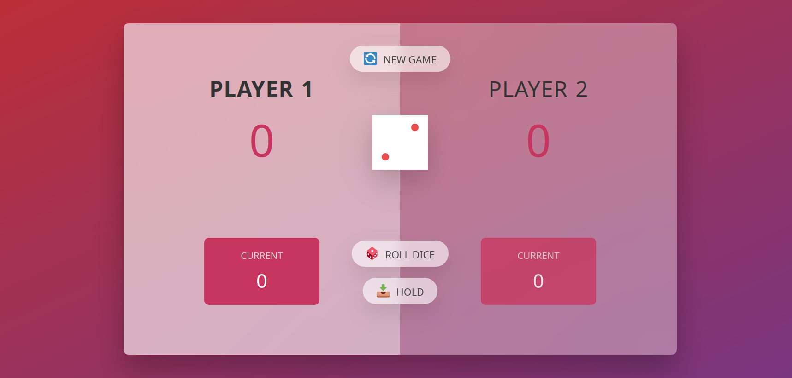

# Dice Game

## Description

**Dice Game** is a thrilling two-player game where the first player to accumulate 50 or more points wins. Players take turns rolling a six-sided die, adding the value to their current score. However, if a player rolls a 1, they lose all their points accumulated in that turn and their turn ends immediately. The game continues until one player reaches or exceeds 50 points.

## Rules

1. The game is played by two players.
2. On their turn, a player rolls a six-sided die.
3. The player adds the value of the die to their current turn score.
4. If the player rolls a 1, they lose all the points accumulated in that turn and their turn ends.
5. The player can choose to "hold" their score, adding the turn score to their total score, and pass the turn to the other player.
6. The first player to reach or exceed 50 points wins the game.

## How to Play

1. Player 1 rolls the die and accumulates points.
2. Player 1 can continue rolling to accumulate more points or choose to hold and pass the turn to Player 2.
3. If Player 1 rolls a 1, they lose all accumulated points for that turn and the turn passes to Player 2.
4. Player 2 follows the same steps.
5. The game continues until one player reaches or exceeds 50 points.
